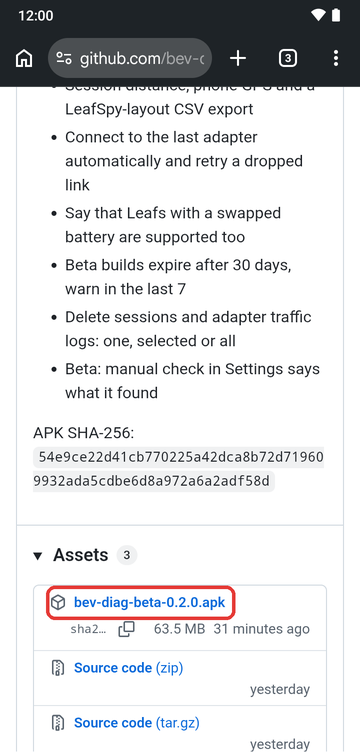
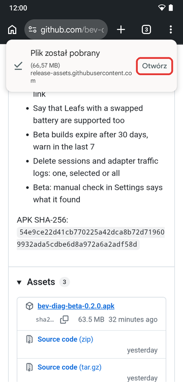
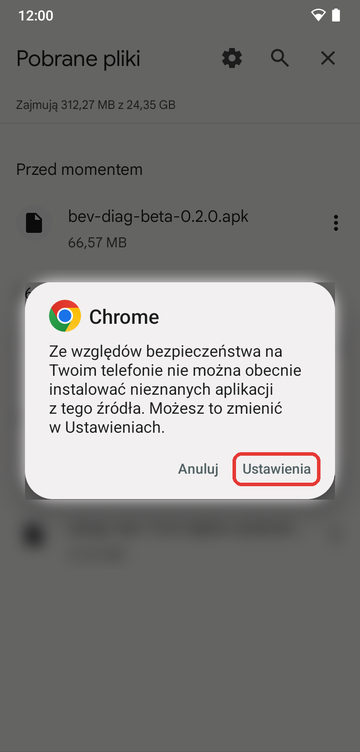
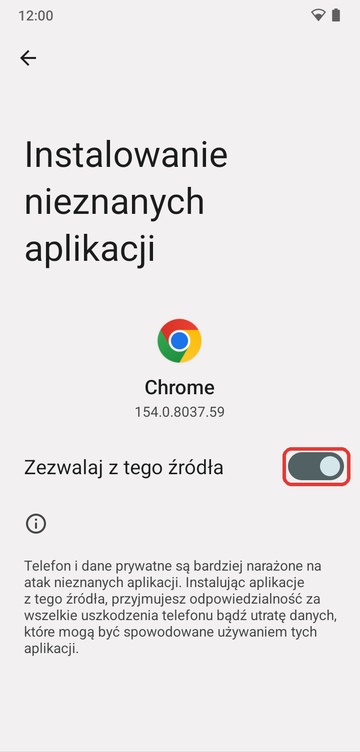
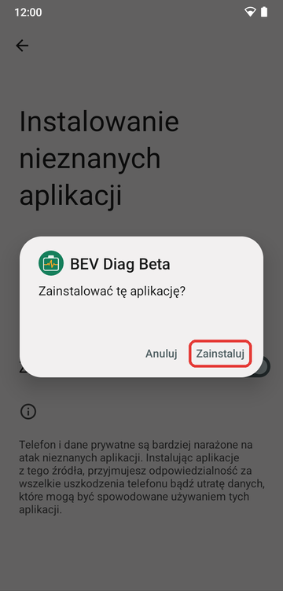
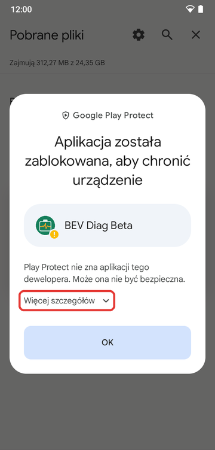
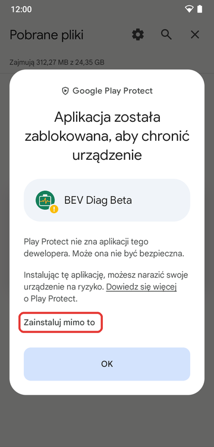
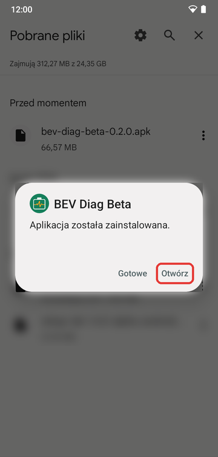

# BEV Diag: wersje testowe / test builds

[Polski](#polski) · [English](#english)

---

## Polski

Testowe wersje aplikacji **BEV Diag** na Androida: diagnostyka baterii
trakcyjnej samochodów elektrycznych przez adapter OBD (ELM327/STN). Na razie obsługiwany jest **Nissan
Leaf** (testowany na AZE0).

To repozytorium zawiera tylko wydania (pliki APK). Kod aplikacji jest
prywatny.

### Instalacja

Aplikacji nie ma w Google Play, więc Android po drodze kilka razy
ostrzeże, że pochodzi z „nieznanego źródła”. To normalne przy
instalacji spoza sklepu. Poniżej cała droga krok po kroku. Screenshoty
są z Androida 13 i Chrome; na Twoim telefonie ekrany mogą wyglądać
trochę inaczej (patrz [niżej](#inny-telefon-inne-ekrany)).

**1. Pobierz plik.** Otwórz
[najnowsze wydanie](https://github.com/bev-diag/bev-diag-releases/releases/latest)
na telefonie, przewiń do sekcji **Assets** i stuknij plik
`bev-diag-beta-….apk`. Gdy pobieranie się skończy, stuknij **Otwórz**.

  
  

**2. Zezwól przeglądarce na instalację.** Android zablokuje instalację
z Chrome. Stuknij **Ustawienia** i włącz **Zezwalaj z tego źródła**.
Robisz to tylko raz.

  
  

**3. Zainstaluj.** Wróć (strzałka wstecz), jeśli telefon sam nie wróci
do instalatora, i stuknij **Zainstaluj**.

  

**4. Ominięcie Google Play Protect.** Play Protect nie zna jeszcze
tej aplikacji i ją „blokuje”. **Nie stukaj OK**, bo to przerwie
instalację. Stuknij **Więcej szczegółów**, a potem
**Zainstaluj mimo to**.

  
  

**5. Gotowe.** Stuknij **Otwórz**. Przy pierwszym uruchomieniu aplikacja
powie, co warto przetestować.

  

#### Inny telefon, inne ekrany

- **Nie widzisz przycisku Otwórz po pobraniu?** Otwórz aplikację
  **Pliki** (albo **Menedżer plików**), wejdź w **Pobrane** i stuknij
  plik `.apk`.
- **Zgoda dotyczy aplikacji, z której otwierasz plik.** Jeśli otwierasz
  go z menedżera plików, a nie z Chrome, krok 2 dotyczy menedżera.
- **Xiaomi / Redmi / POCO (MIUI, HyperOS):** telefon może dodatkowo
  kazać odczekać kilka sekund przed zatwierdzeniem albo sam zeskanować
  aplikację. Zatwierdź.
- **Samsung:** jeśli instalacja jest zablokowana bez żadnej opcji,
  wyłącz w ustawieniach (**Zabezpieczenia i prywatność**) funkcję
  **Auto Blocker**, zainstaluj aplikację i możesz ją włączyć z powrotem.
- **Aktualizacja** to te same kroki, z nowszym plikiem. Zgodę z kroku 2
  masz już za sobą, a Play Protect może zapytać ponownie. Twoje dane
  w aplikacji zostają.

### Adaptery

Potwierdzone (sprawdzone z aplikacją):

- Konnwei KW905
- Qerk KW905

Inne adaptery ELM327/STN mogą działać, ale nie są jeszcze potwierdzone.
Aplikacja łączy się przez:

- Bluetooth LE
- Bluetooth klasyczny (najpierw sparuj adapter w ustawieniach telefonu)
- WiFi (domyślnie 192.168.0.10:35000)

Działa Ci inny adapter? Koniecznie
[daj znać](https://github.com/bev-diag/bev-diag-releases/issues/new?template=adapter.yml),
dopiszemy go do listy.

### Ważne: to wersja testowa

- Aplikacja może pokazywać błędne wartości. Nie podejmuj na ich podstawie
  decyzji o zakupie lub naprawie auta.
- Wersje testowe mają ograniczony czas działania; aplikacja powie, kiedy
  pobrać nowszą.

### Zgłaszanie błędów

[Załóż zgłoszenie](https://github.com/bev-diag/bev-diag-releases/issues/new/choose)
(potrzebne konto GitHub). Bardzo pomaga log ruchu adaptera:
Ustawienia → Logi ruchu adaptera → Udostępnij ostatni log.

### Kontakt

Pytania, uwagi albo zgłoszenie bez konta GitHub:
[bevdiag@gmail.com](mailto:bevdiag@gmail.com)

---

## English

Test builds of the **BEV Diag** app for Android: traction battery
diagnostics for electric cars over an OBD adapter (ELM327/STN). For now the
**Nissan Leaf** is supported (tested on the AZE0).

This repository holds releases (APK files) only. The app's source code is
private.

### Installing

The app is not on Google Play, so Android warns you a few times along
the way that it comes from an "unknown source". That is normal when
installing outside the store. Below is the whole path, step by step.
The screenshots are from Android 13 and Chrome, in Polish; the button
names are given in English below. Your phone may look somewhat
different (see [below](#other-phone-other-screens)).

**1. Download the file.** Open the
[latest release](https://github.com/bev-diag/bev-diag-releases/releases/latest)
on your phone, scroll to **Assets** and tap the
`bev-diag-beta-….apk` file. When the download finishes, tap **Open**.

  
  

**2. Let the browser install apps.** Android blocks installing from
Chrome. Tap **Settings** and turn on **Allow from this source**. You
only do this once.

  
  

**3. Install.** Go back (back arrow) if the phone does not return to the
installer on its own, and tap **Install**.

  

**4. Get past Google Play Protect.** Play Protect does not know this
app yet and "blocks" it. **Do not tap OK**, that cancels the install.
Tap **More details**, then **Install anyway**.

  
  

**5. Done.** Tap **Open**. On first launch the app tells you what is
worth testing.

  

#### Other phone, other screens

- **No Open button after the download?** Open the **Files** (or **File
  Manager**) app, go to **Downloads** and tap the `.apk` file.
- **The permission is for the app you open the file from.** If you open
  it from a file manager instead of Chrome, step 2 applies to the file
  manager.
- **Xiaomi / Redmi / POCO (MIUI, HyperOS):** the phone may also make you
  wait a few seconds before confirming, or scan the app itself. Confirm.
- **Samsung:** if the install is blocked with no option to continue,
  turn off **Settings → Security and privacy → Auto Blocker**, install
  the app, then you can turn it back on.
- **Updating** is the same steps with the newer file. You have already
  done step 2, and Play Protect may ask again. Your data in the app is
  kept.

### Adapters

Confirmed (tested with the app):

- Konnwei KW905
- Qerk KW905

Other ELM327/STN adapters may work but are not confirmed yet. The app
connects over:

- Bluetooth LE
- Bluetooth Classic (pair the adapter in the phone's settings first)
- WiFi (default 192.168.0.10:35000)

Another adapter works for you? Be sure to
[let us know](https://github.com/bev-diag/bev-diag-releases/issues/new?template=adapter.yml),
and we will add it to the list.

### Important: this is a test build

- The app may show wrong values. Do not base decisions about buying or
  repairing a car on them.
- Test builds work for a limited time; the app tells you when to get a
  newer one.

### Reporting problems

[Open an issue](https://github.com/bev-diag/bev-diag-releases/issues/new/choose)
(needs a GitHub account). The adapter traffic log helps a lot:
Settings → Adapter traffic logs → Share latest log.

### Contact

Questions, feedback, or a report without a GitHub account:
[bevdiag@gmail.com](mailto:bevdiag@gmail.com)
